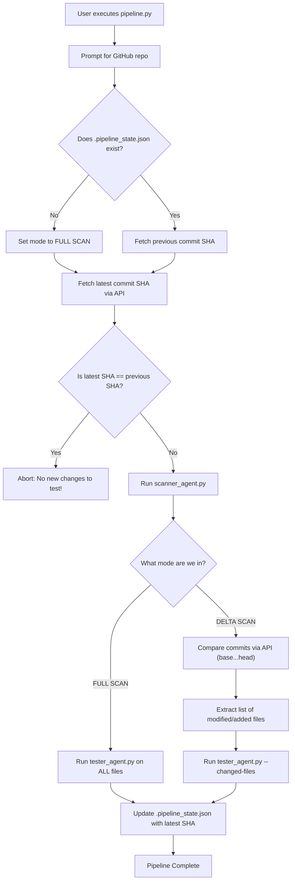

# Automated Delta Testing Pipeline Plan

## Goal
Create an automated, end-to-end orchestration pipeline (`pipeline.py`) that accepts a GitHub repository from the user, runs the Scanner Agent, and then conditionally runs the Tester Agent. If the repository has been scanned before, it will perform **Delta Testing**, generating test cases *only* for the files that were modified in the newest pushes.

## Proposed Architecture

### 1. New Core Script: `pipeline.py`
This script will act as the master orchestrator.
- Prompts the user for the GitHub repository (e.g., `owner/repo`) if not provided via command line.
- Identifies the latest commit SHA on the main branch.
- Checks `output/<repo>/.pipeline_state.json` to see if a previous scan exists and what the last commit SHA was.
- Executes `scanner_agent.py` to generate the updated Knowledge Base and Graph.
- If this is a **new run**, it executes `tester_agent.py` normally (tests everything).
- If this is a **delta run**, it compares the old SHA and new SHA using the GitHub API to extract a list of modified files, and passes this list to `tester_agent.py`.
- Updates the `.pipeline_state.json` with the new commit SHA.

### 2. Pipeline Logic Flowchart

### Detailed Logic Breakdown

1. **The Starting Point**
   When you run the script, it first prompts you for the GitHub repository you want to scan.
2. **The First Decision: Have we scanned this before?**
   The script checks your local folder to see if a hidden file named `.pipeline_state.json` exists. This file acts as our "memory".
   - *IF NO (First Time)*: We have never scanned this repo before. The script sets an internal flag to FULL SCAN MODE.
   - *IF YES (Returning)*: We have scanned this before. The script opens the state file and extracts the Commit SHA from the last time we ran the pipeline. The script sets the internal flag to DELTA SCAN MODE.
3. **The Second Decision: Is there actually new code?**
   The script connects to GitHub and asks for the absolute latest Commit SHA on the main branch.
   - *IF Latest == Previous*: The script instantly stops. It tells you "Abort: No new changes to test!" because nobody has pushed any new code.
   - *IF Latest != Previous (or first run)*: There is new code. The script executes `scanner_agent.py` to trigger the cloud AST extractor and download a fresh `kb.json`.
4. **The Third Decision: How much do we test?**
   - *IF FULL SCAN MODE*: The script executes `tester_agent.py` normally. The tester writes tests for every single function in the repository.
   - *IF DELTA SCAN MODE*: The script asks GitHub to compare the Previous SHA against the Latest SHA. GitHub responds with an exact list of files that were modified. The pipeline executes `tester_agent.py --changed-files`. The tester filters the graph and only uses Gemini to write tests for functions located inside those specific changed files.
5. **Final Step**
   Regardless of which mode it ran in, the script finishes by writing the Latest SHA into `.pipeline_state.json`, effectively updating its "memory" so it is ready for next time.

### 3. Update `core/github_client.py`
We need to add two new methods to interact with the GitHub API for commit tracking:
- `get_latest_commit(owner, repo)`: Fetches the HEAD commit SHA of the default branch.
- `compare_commits(owner, repo, base_sha, head_sha)`: Uses the `GET /repos/{owner}/{repo}/compare/{base}...{head}` endpoint to return a list of exactly which files were added or modified.

### 4. Update `agents/tester_agent.py`
The tester agent needs to understand delta boundaries so it doesn't waste LLM tokens re-testing old code.
- Add a new CLI argument: `--changed-files` (comma-separated list of file paths).
- During the graph filtering phase, if `--changed-files` is provided, it will strictly filter the `java_files` set to ONLY include files whose paths match the changed list. 
- The Topological Sort will then naturally isolate just the new/modified functions and test them.
