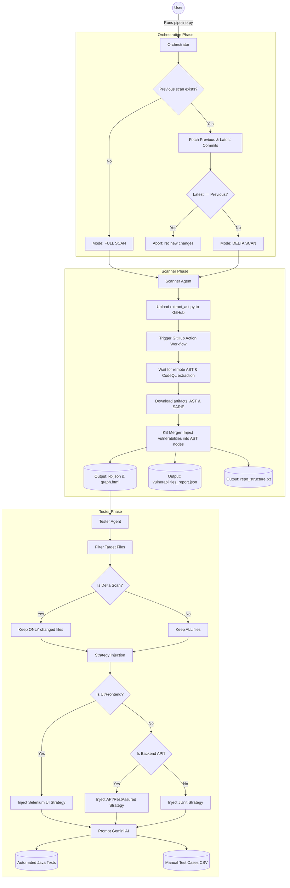

# KB-Scanner Pipeline Architecture & Workflow

This document outlines the end-to-end architecture and data flow of the KB-Scanner system. The system is designed to autonomously map a repository, integrate security vulnerabilities, and generate both automated (JUnit/Selenium/API) and manual test cases using AI.

## High-Level Architecture

The system is composed of three primary components:
1. **Pipeline Orchestrator (`pipeline.py`)**: The master controller that manages the state, calculates code deltas, and coordinates the agents.
2. **Scanner Agent (`scanner_agent.py`)**: The extractor that builds the structural Knowledge Graph (`kb.json`) and merges CodeQL vulnerability reports into it.
3. **Tester Agent (`tester_agent.py`)**: The AI engine that reads the Knowledge Graph, assigns testing strategies based on the code's context, and uses Gemini to write the actual tests.

---

## The Workflow Flowchart

---

## Component Deep Dive

### 1. Delta Testing (Orchestrator)
To save LLM tokens and execution time, the pipeline stores the latest commit SHA in `.pipeline_state.json`. On subsequent runs, it asks the GitHub API for exactly which files were modified between the previous scan and the current repository state. It passes this "changed files" list to the Tester Agent so it only writes tests for new code.

### 2. Knowledge Graph Generation (Scanner)
To strictly adhere to security policies, the code is **never cloned locally** for scanning. Instead, the Scanner triggers a GitHub Action in the cloud. The cloud workflow uses Tree-sitter to parse Python, Java, JavaScript, and TypeScript into a JSON structural graph (`kb.json`). 
- **CodeQL Integration**: The Scanner downloads the GitHub Advanced Security (CodeQL) SARIF report and physically maps the exploits to the exact AST function nodes where the vulnerabilities exist.
- **Frontend Bodies**: For frontend UI files, the scanner extracts the raw HTML/JSX tags into the Knowledge Graph so the AI can read DOM IDs for testing.

### 3. AI Test Generation (Tester)
The Tester Agent topologically sorts the graph to test deeply nested dependencies first. It analyzes the context of each function (decorators, parameters, dependencies, and CodeQL vulnerabilities) to inject a custom test strategy into the prompt.
- **Frontend / React**: Generates E2E Selenium WebDriver UI tests.
- **Backend `@RestController`**: Generates API Integration tests (RestAssured/MockMvc).
- **Vulnerable Code**: Generates specific Negative/Security regression tests to verify CodeQL patches.
